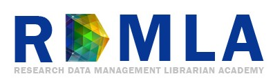
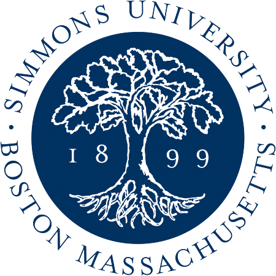
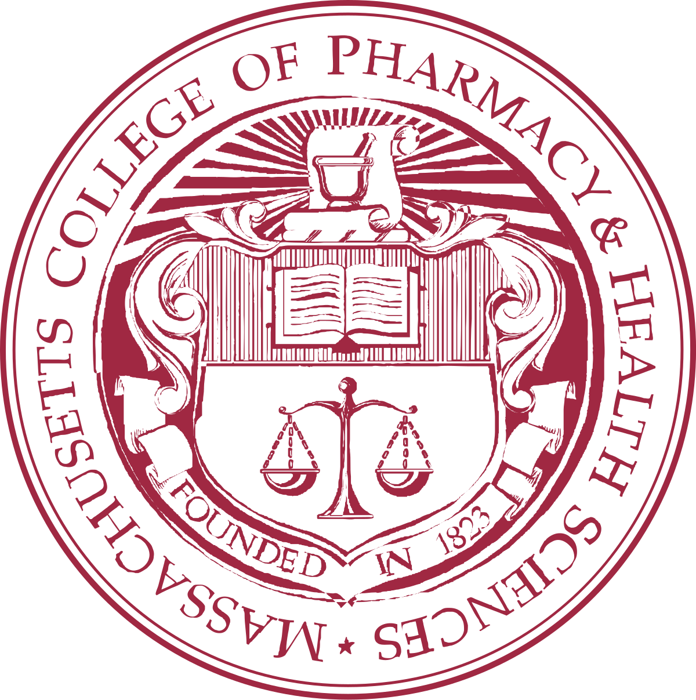
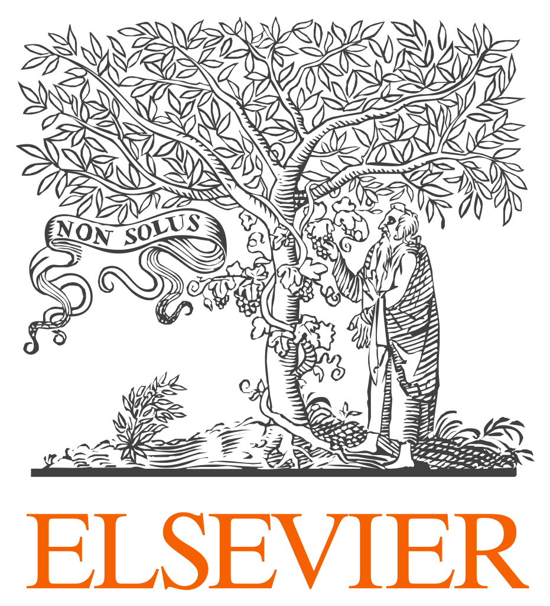

  
The **Research Data Management Librarian Academy** (**RDMLA**) is a free online professional development program for librarians, information professionals, or other professionals who work in a research-intensive environment throughout the world. 

RDMLA features a unique partnership between a LIS academic program, academic health sciences and research libraries, and Elsevier, which financially supported the program. 

Partner institutions include:  

  &nbsp;&nbsp; &nbsp;&nbsp; 
 &nbsp;&nbsp; &nbsp;&nbsp;
 &nbsp;&nbsp;&nbsp;&nbsp; 
 &nbsp;&nbsp; &nbsp;&nbsp;
 &nbsp;&nbsp;&nbsp; &nbsp;
 &nbsp;&nbsp;&nbsp;&nbsp; 
 &nbsp;&nbsp;&nbsp; &nbsp;
 &nbsp;&nbsp; &nbsp;&nbsp;
  

Find out more about the RDMLA community here: <a href="https://rdmla.github.io/home/partners/">RDMLA Community</a>.

## RDMLA Curriculum

The **RDMLA** curriculum focuses on the essential knowledge and skills needed to collaborate effectively with researchers on data management. The curriculum features **Eight Online Self-paced Learning Units** that covers topics such as the foundations of research data management (RDM), research culture, advocating and marketing for RDM services in libraries, project management, overview of research data management tools and etc.  

The **RDMLA** Course, which will be hosted in the Canvas Learning Management System and is currently under production.The expected launch is in **Fall, 2019**. Access <a href="https://rdmla.github.io/home/course/"> RDMLA Course </a> to get a sneek-peek.  

The **RDMLA** curriculum is based on the results from the Needs Assessment Survey in Phase I (Learn more about Phase I research here:'<a href="https://rdmla.github.io/home/about/"> RDMLA Project Phase I Report Survey Results</a>').  

## RDMLA Events

Read about the partnership in the Library Connect article: <i><a href="https://libraryconnect.elsevier.com/articles/research-data-management-librarian-academy-rdmla-global-online-learning-community 
">Research Data Management Librarian Academy (RDMLA): A global online learning community</a></i>.

**RDMLA** community has been active in various conferences, you can find a list of the conference presentations here:
[Presentations](https://github.com/RDMLA/home/blob/master/presentation-slides.pdf)

## Become a Member

Interested in learning more about RDMLA? <a href="https://rdmla.github.io/contact/">Contact us</a>!
